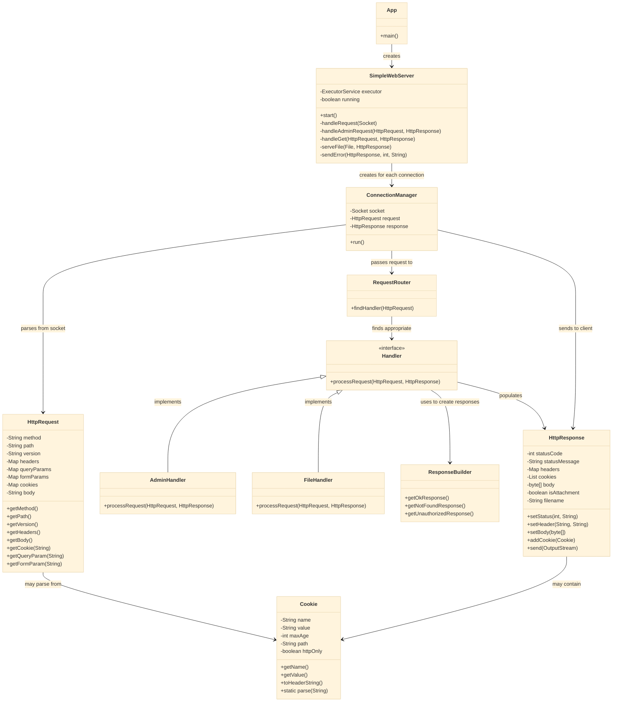

# HTTP Server Class Diagram

> Note: This class diagram shows the relationships between the main components of the HTTP Server implementation. The diagram is optimized for readability with a size of 1600x1200 pixels.
